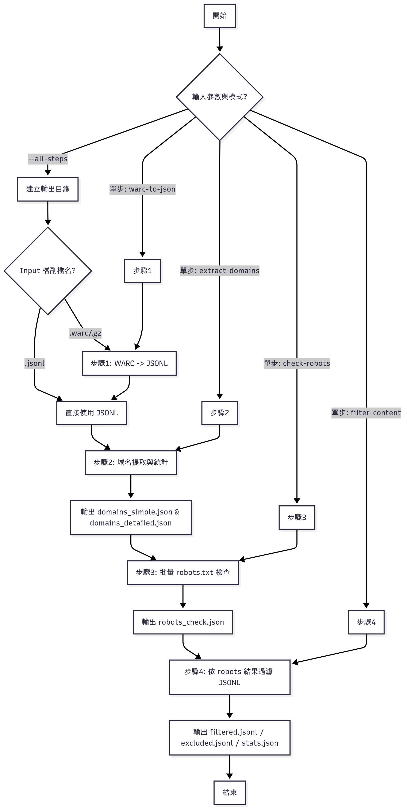
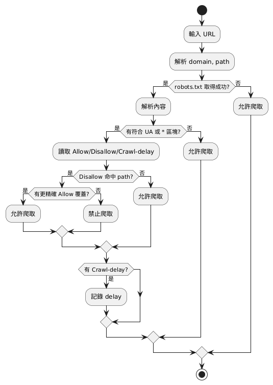

# FineWeb Domain Analyzer

一個完整的 FineWeb 數據集域名分析和內容清洗工具，提供四大核心功能幫助研究人員安全、合規地處理網頁抓取數據。

## 📋 系統架構

### 整體流程圖


### Robots.txt 檢查流程


## ✨ 核心功能

1. **WARC 轉 JSON** - 將 WARC 文件轉換為易處理的 JSONL 格式
2. **域名分析** - 從數據中提取和統計所有域名
3. **Robots.txt 檢查** - 批量檢查域名的爬取權限
4. **內容過濾** - 基於 robots.txt 結果清洗數據

## 🚀 快速開始

### 安裝依賴
```bash
pip install -r requirements.txt
```

### 完整流程執行
```bash
# 一鍵執行完整的 4 步流程
python fineweb_analyzer.py --input your_data.warc.gz --all-steps --verbose
```

### 分步執行
```bash
# 步驟 1: WARC 轉 JSON
python fineweb_analyzer.py --input data.warc.gz --warc-to-json --verbose

# 步驟 2: 域名分析
python fineweb_analyzer.py --input data.jsonl --extract-domains --verbose

# 步驟 3: Robots.txt 檢查
python fineweb_analyzer.py --domains domains_simple_*.json --check-robots --verbose

# 步驟 4: 內容過濾
python fineweb_analyzer.py --input data.jsonl --robots robots_check_*.json --filter-content --verbose
```

## 📊 輸出文件說明

### 域名分析結果
- `domains_simple_*.json` - 簡單域名列表
- `domains_detailed_*.json` - 詳細域名統計

### Robots.txt 檢查結果
- `robots_check_*.json` - 完整的 robots.txt 檢查結果

### 內容過濾結果
- `filtered_*.jsonl` - 可安全使用的清洗後數據
- `excluded_*.jsonl` - 被排除的內容
- `filter_stats_*.json` - 過濾統計報告

## 🎯 使用案例

### 學術研究
```bash
# 處理 FineWeb 數據集用於 NLP 研究
python fineweb_analyzer.py --input CC-MAIN-*.warc.gz --all-steps --max-records 10000
```

### 數據清洗
```bash
# 只對現有 JSON 數據進行域名合規檢查
python fineweb_analyzer.py --input existing_data.jsonl --extract-domains
python fineweb_analyzer.py --domains domains_simple_*.json --check-robots
python fineweb_analyzer.py --input existing_data.jsonl --robots robots_check_*.json --filter-content
```

## ⚙️ 參數說明

| 參數 | 說明 | 默認值 |
|------|------|--------|
| `--input` | 輸入文件路径 | 必需 |
| `--output` | 輸出目錄 | `output` |
| `--verbose` | 詳細輸出 | `False` |
| `--max-records` | 最大處理記錄數 | 無限制 |
| `--timeout` | 請求超時時間 | 10秒 |
| `--max-workers` | 最大併發數 | 10 |

## 🔍 Robots.txt 合規性

本工具嚴格遵循 robots.txt 協議，詳細的檢查流程請參考 [Robots.txt 檢查流程圖](chart/robotstxt_check_pipeline.png)：

### 自動檢查機制
- ✅ **自動檢查** robots.txt 文件存在性
- ✅ **遵循 Disallow 規則** - 解析並應用禁止訪問路徑
- ✅ **尊重 Crawl-delay 設置** - 識別並記錄延遲要求
- ✅ **識別 AI 專用限制** (GPTBot, ClaudeBot, CCBot, Google-Extended 等)
- ✅ **保護版權敏感內容** - 自動標記高風險域名

### 判斷邏輯
1. **優先檢查 HTTPS** - 首先嘗試 https://domain/robots.txt
2. **回退到 HTTP** - HTTPS 失敗時嘗試 http://domain/robots.txt
3. **404 = 默認允許** - 無 robots.txt 文件視為允許爬取
4. **解析 User-agent** - 識別適用於通用爬蟲 (*) 的規則
5. **AI 爬蟲特殊處理** - 檢測針對 AI 訓練的特殊限制

## 📈 性能特點

- **高效處理**: 支持大文件並發處理
- **內存友好**: 流式處理，適合大數據集
- **可靠性**: 自動重試和錯誤處理
- **標準兼容**: 遵循 RFC 9309 robots.txt 標準

## 🛡️ 合規和道德考量

### 自動識別和排除：
- 明確禁止 AI 訓練的網站
- 版權保護的內容
- 個人隱私敏感數據
- 已停用或無法訪問的服務

### 建議的使用原則：
1. **學術優先**: 優先使用教育和研究機構數據
2. **開源友好**: 開源項目數據通常使用友好
3. **商業謹慎**: 商業網站需要額外注意版權
4. **定期更新**: robots.txt 可能會變更，建議定期重新檢查

## 📁 項目結構

```
fineweb-domain-analyzer/
├── fineweb_analyzer.py     # 主程序
├── requirements.txt        # 依賴列表
├── LICENSE                 # MIT 許可證
├── README.md              # 使用說明
├── chart/                 # 流程圖文檔
│   ├── script_pipeline.png           # 整體系統流程圖
│   └── robotstxt_check_pipeline.png  # Robots.txt 檢查流程圖
├── examples/              # 示例數據
│   ├── test_data.jsonl    # 測試用 JSONL 數據
│   └── README.md          # 示例數據說明
└── output/               # 輸出目錄
    ├── *.jsonl          # 轉換和過濾後的數據
    ├── domains_*.json   # 域名分析結果
    ├── robots_*.json    # Robots.txt 檢查結果
    └── filter_*.json    # 過濾統計報告
```

## 🤝 貢獻指南

歡迎提交 Issue 和 Pull Request！

### 開發環境
```bash
git clone https://github.com/Edwarddev0723/fineweb-domain-analyzer.git
cd fineweb-domain-analyzer
pip install -r requirements.txt
```

### 運行測試
```bash
# 使用示例數據測試完整流程
python fineweb_analyzer.py --input examples/test_data.jsonl --all-steps --verbose

# 使用小樣本測試
python fineweb_analyzer.py --input sample.warc.gz --all-steps --max-records 100 --verbose
```

## 🔄 工作流程詳解

### 四步驟處理流程
如 [整體流程圖](chart/script_pipeline.png) 所示，系統包含四個主要處理步驟：

1. **📄 WARC 轉 JSON** 
   - 輸入：WARC/WARC.gz 文件
   - 處理：提取 HTTP 響應記錄
   - 輸出：JSONL 格式的結構化數據

2. **🔍 域名分析**
   - 輸入：JSONL 數據文件
   - 處理：提取並統計所有唯一域名
   - 輸出：域名列表和詳細統計

3. **🤖 Robots.txt 檢查**
   - 輸入：域名列表
   - 處理：並發檢查每個域名的 robots.txt
   - 輸出：爬取權限分析結果

4. **🔧 內容過濾**
   - 輸入：原始 JSONL + Robots.txt 結果
   - 處理：基於合規性過濾內容
   - 輸出：清洗後的安全數據

### 數據流轉換
```
WARC → JSONL → 域名列表 → Robots.txt結果 → 過濾後數據
  ↓      ↓        ↓           ↓            ↓
 原始   結構化   域名統計   合規性分析    安全數據
```

## 📞 支持

- 🐛 **Bug 報告**: [GitHub Issues](https://github.com/Edwarddev0723/fineweb-domain-analyzer/issues)
- 💡 **功能建議**: [GitHub Discussions](https://github.com/Edwarddev0723/fineweb-domain-analyzer/discussions)
- 📧 **聯繫方式**: 通過 GitHub 聯繫

## 📷 流程圖說明

### 整體架構圖 (script_pipeline.png)
展示了從原始 WARC 文件到最終清洗數據的完整四步驟流程，包括：
- 數據格式轉換路徑
- 各步驟的輸入輸出關係
- 並行處理和決策分支點
- 最終的數據分類結果

### Robots.txt 檢查流程 (robotstxt_check_pipeline.png)
詳細說明了域名合規性檢查的邏輯：
- HTTPS/HTTP 協議優先級
- robots.txt 文件解析步驟
- User-agent 匹配規則
- Disallow/Allow 路徑處理
- AI 爬蟲特殊限制識別
- 最終可爬性判斷標準

---

**⚠️ 重要提醒**: 使用本工具處理數據時，請確保遵循相關法律法規和數據使用政策。本工具旨在幫助研究人員合規地處理網頁數據，促進負責任的 AI 研究發展。

